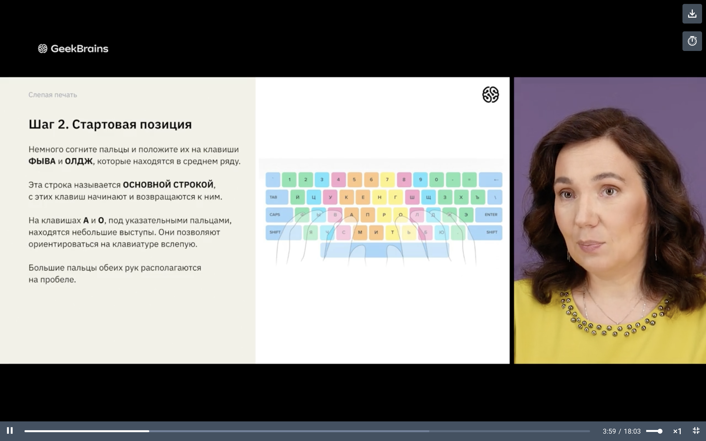

# Приветствую тебя, мой друг!

### Мне нравится выбранный курс от GeekBrains!
*******
Для начала работы с Markdown необходимо изучить правила работы с разметкой

## Заголовки

H1 и H2 добавляются в навигацию слева, H1 - H6 можно добавить в содержание статьи.
# H1
## H2
### H3
#### H4
##### H5
###### H5

## Работа с изображениями
Чтобы добавить изображение, необходимо добавить следующий порядок символов "!" "[]"()". Сначала добавляем восклицательный знак, далее квадратные скобки [], после квадратных скобок добавляем круглые скобки (). В квадратных скобках указываем название файла, которое будет указано в случае, если наше изображение не будет показываться, в круглых скобках указываем путь к изображению. Если изображение будет находиться в репозитории, то достаточно указать точное название с раширением, и Git его сам подтянет.
Например, 
и еще пример 

Аналогично добавляются изображения в других форматах, например, screenshot.

## Ссылки
Для оформления ссылок указываем текст ссылки, заключив его в квадратные скобки, и сразу после в круглых скобках указываем URL-адрес
Пример
[GeekBrains](http://Geekbrains.ru)

Также для ссылки можно указать всплывающую подсказку (title), используя кавычки внутри круглых скобок.
Пример
[GeekBrains](http://Geekbrains.ru "сайт GB")

## Цитаты
Цитаты размечаются с помощью символа «>». Допускается не более 15 уровней цитирования
> век живи, век учись!
>> повторение - мать учения!
>>> знание - сила!

Цитаты могут быть добавлены в списки, как нумерованные, так и ненумерованные. Для добавления цитаты внутри списка неоходимо с отступом через символ (>) добавить цитату.
Пример:
    План на неделю:
+ сделать домашнее задание ко второму семинару
    > День, в который вы не узнали ничего нового, прошел впустую.
+ дополнительно создать файл и попрактиковать работу с Markdown.

Пример с нумерованным списком:
    План на неделю:
1. сделать домашнее задание ко второму семинару
    > Образование - ключ для открытия золотых ворот свободы. Дж. Вашингтон.
2. дополнительно создать файл и попрактиковать работу с Markdown.

## Работа с текстом
Для написания слова или предложения курсивом необходимо выделить текст слева и справа символом (*) или (-)
Пример:
*Как тебе работается сегодня?*
*Урок 2* или _Урок 2_

Чтобы выделить текст полужирным, необходимо его обрамить знаком (**) или (__)
Например, **Урок 2** или __Урок 2__

Чтобы выделить текст и полужирным и курсивом, можно выделить текст знаками (__*) 
Например, __*Урок*__
Для выделения текста необходимо нажать знак #

Для выделения подзаголовка необходимо перед выбранным текстом набрать два знака решетки (##)

### Получается? Идем дальше ->

Для выделения строки можно поставить три знака решетка через пробел перед предложением (###)

## Списки 
Чтобы добавить ненумерованные списки, необходимо пункты выделить знаком (*) или знаком (-) или знаком (+)
Пример, 
- пункт 1
- пункт 2

или 
+ пункт 1
+ пункт 2

или 
* пункт 1
* пункт 2

Чтобы добавить нумерованный список просто добавляем номера списка по порядку
Например,
1. пункт 1
2. пункт 2

Для создания нумерованного списка ставим 1., 2. и так далее

Мои цели должны быть:
1. конкретны S
2. измеримы M
3. достижимы A
4. значимы R
5. определены по времени с конкрентным сроком T

Списки могут быть вложенными:
1. Пункт 1
    + вложить файл
2. Пункт 2

## Блоки кода

Фрагменты исходного кода выделяются просто: каждая строка блока должна иметь отступ в четыре пробела либо в один символ табуляции
обычно отмечаемые тегом

    <code>

## Зачеркнутый текст через символ ~~
Например, ~~научилась работать с Markdown~~ 

## Работа с таблицами
для работы с таблицами 
    |столбец 1| |столбец 2| |столбец 3|
    |:-------А| |:------:В| |:------:C|